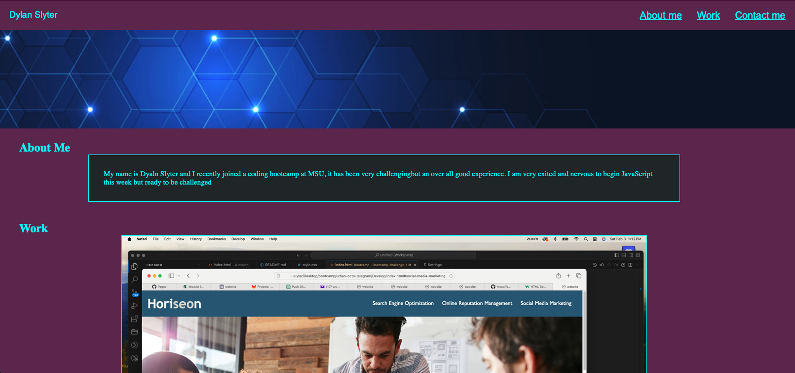
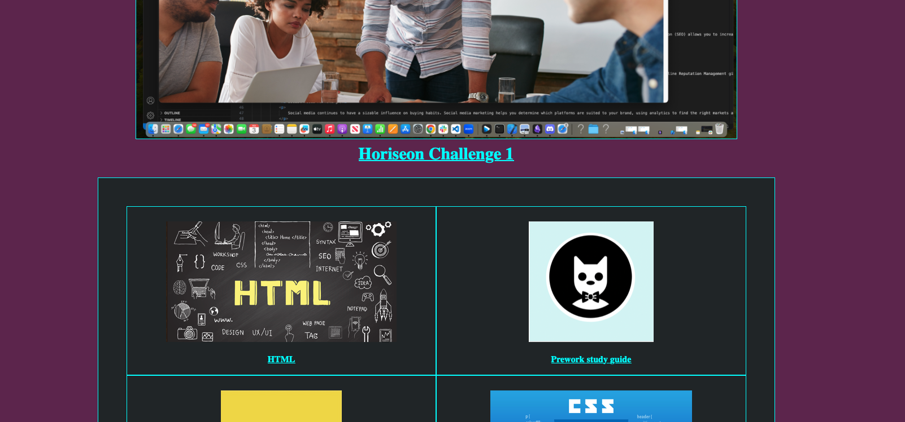
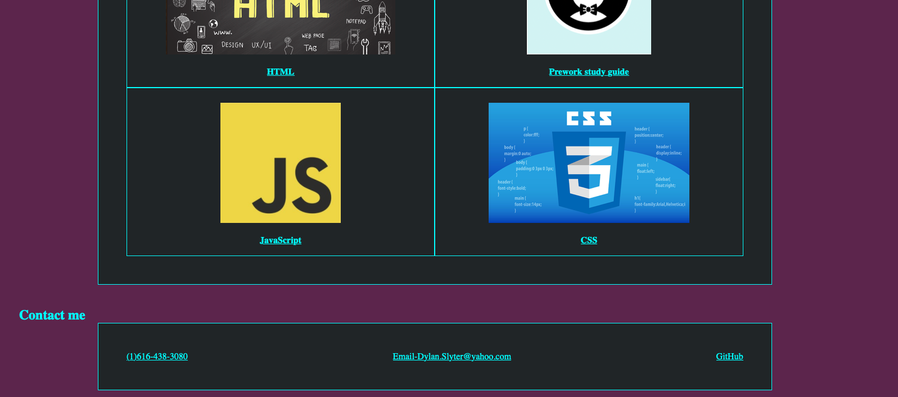

# <Challenge-two>

[website url]( https://dylanslyter.github.io/First-portfolio-DS-challenge-2/)

## Description
Created a simple portfolio for myself usng CSS and HTML.
## Installation

N/A

## Usage
Can see some information about me and can visit my first challenge one
## Credits

N/A

## License

Please refer to the LICENSE in the repo.
---

🏆 The previous sections are the bare minimum, and your project will ultimately determine the content of this document. You might also want to consider adding the following sections.

## Badges

Badges aren't necessary, but they demonstrate street cred. Badges let other developers know that you know what you're doing. Check out the badges hosted by [shields.io](https://shields.io/). You may not understand what they all represent now, but you will in time.

## Features

If your project has a lot of features, list them here.

